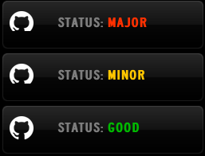

#GitHub Status for Status Board

A widget for [Status Board for iPad](http://panic.com/statusboard) to show the current status of GitHub (`Good`, `Minor`, `Major`). It checks [status.github.com](http://status.github.com) every 15 minutes for changes.

##Usage

**Manual**: Select the "Do-It-Yourself" widget and set the panel URL to `http://labs.robblewis.me/githubstatusboard`

**Automatic**: Visit [this page](http://labs.robblewis.me/githubstatusboard/add.html) this page on your iPad and press "Add to Status Board". *NB: If you're running iOS7, the automatic link may cause Status Board to become unusable. You have been warned.*

**Self Hosted**: Upload the file to your server and set a DIY panel to `yourdomain/githubstatus`. *NB: You will need to change the URL in `add.php` if you wish to use automatic adding to Status Board.*
